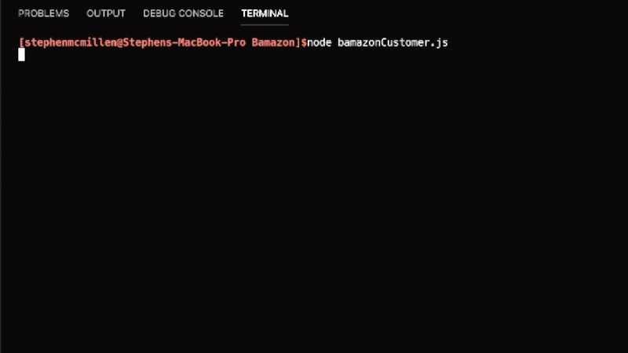
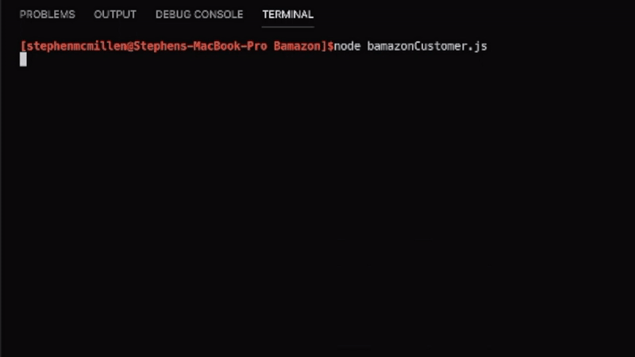
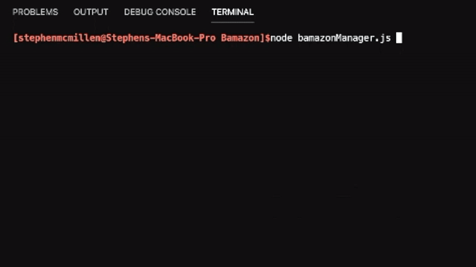
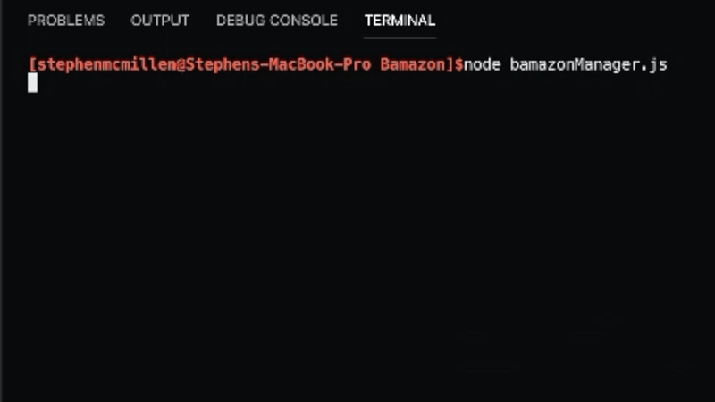
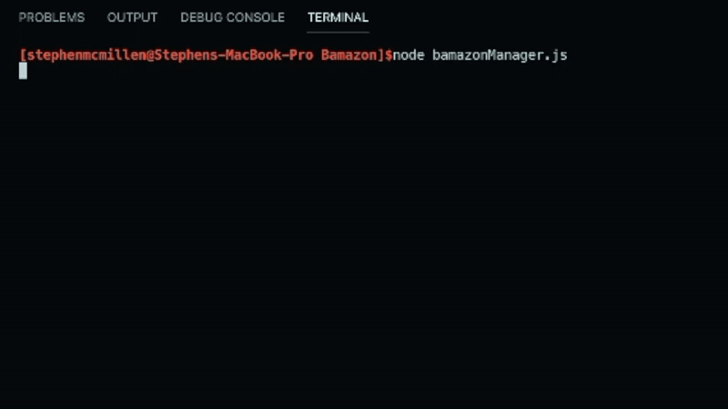
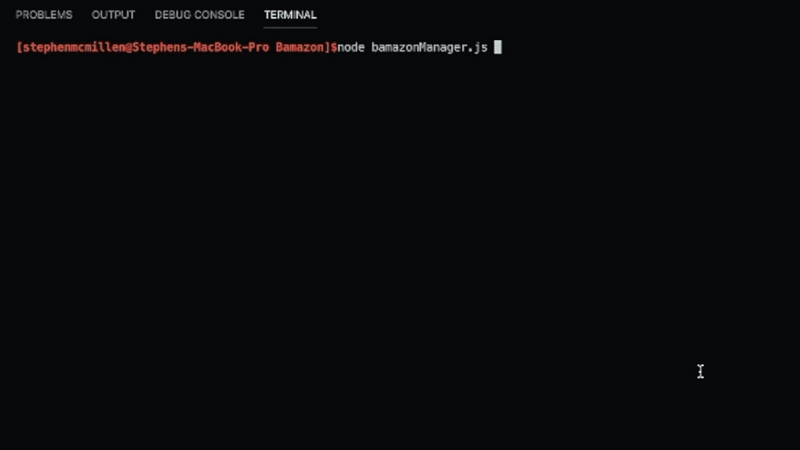

# Bamazon
## **Your one-stop shop for very specific items!**

#### ***Bamazon User Manual***

Say goodbye to big-box stores and chain supermarkets! Bamazon has the good that would make Jeff Bezos blush!

***The following elements have been used in creating this Bamazon Store:***

- Javascript
- Node.js
- Node Arguments
- Switch Statements
- Inquirer Prompts
- .env files
- .gitignore
- SQL Workbench
- MySQL node module
- Chalk node module
- Connection Queries
- And many more!

# Bamazon Customer Interface #
 ## 1. **If stock quantity is available:**

 

 ## 2. **If stock quantity is insufficient:**

 

# Bamazon Manager Interface #
 ## 1. **View Products for Sale**

  

 ## 2. **Restock Items**
 
 

 ## 3. **Displays Low Inventory Items (Items with less than 50 in stock)**
 
 

 ## 4. **Add New Products**
 
 

## You're ready to start shopping! ##